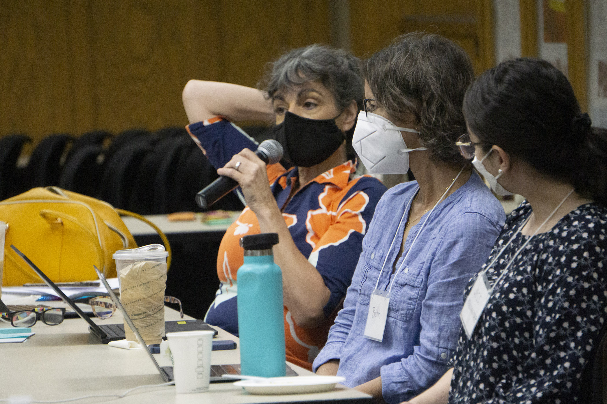
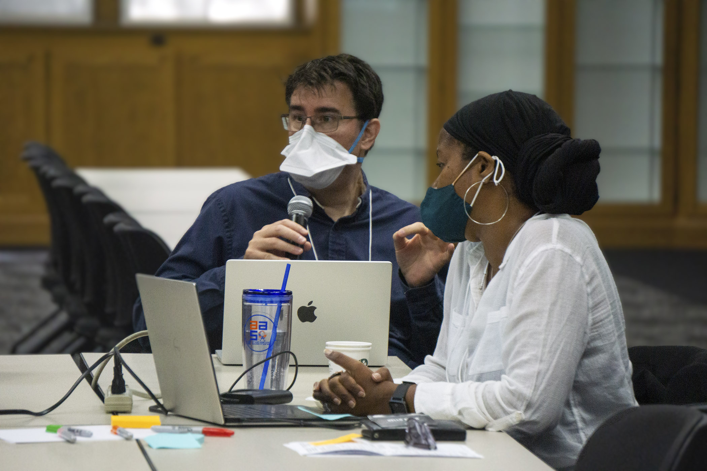
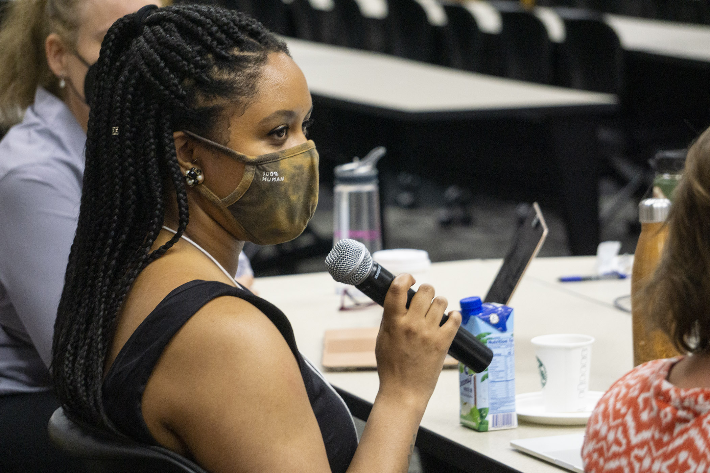
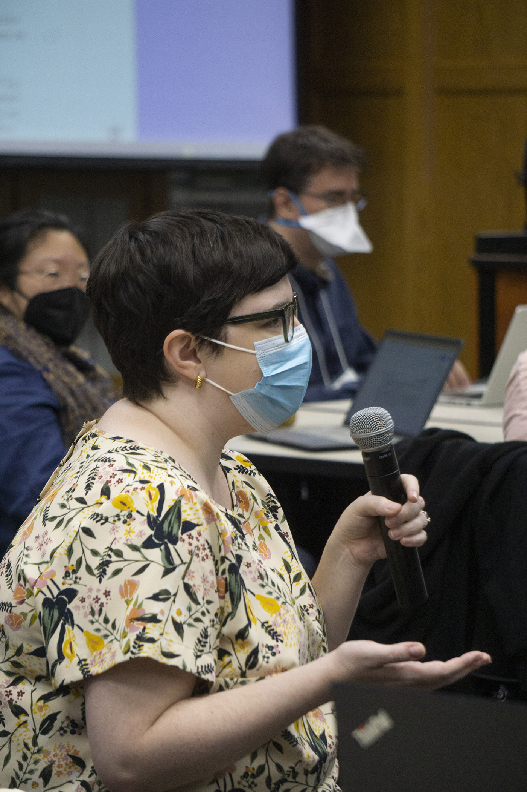
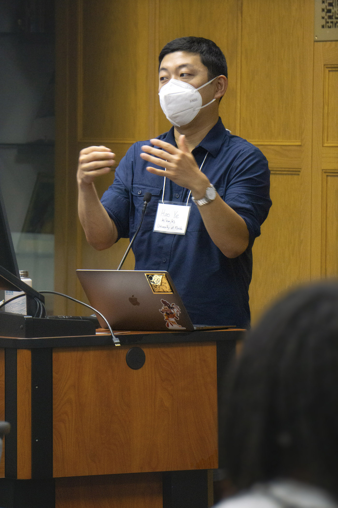

The Planning for Open Grants project conducted an in-person advisory group meeting in May 2022 at the University of Florida George A. Smathers Libraries.

The meeting brought together more than 20 stakeholders involved in the grant proposal process, including writing, seeking and review, from universities, funding institutions and foundations. The meeting discussions focused on identifying common or shared challenges related to making grant proposals open access, as well as potential benefits and incentives for making proposals open access, and possibilities for the creation of more collaborative, grant seeking and sharing communities going forward.

We are grateful for everyone who was able to attend, and to IMLS for supporting this project with travel funds and stipends for our advisory group members!

